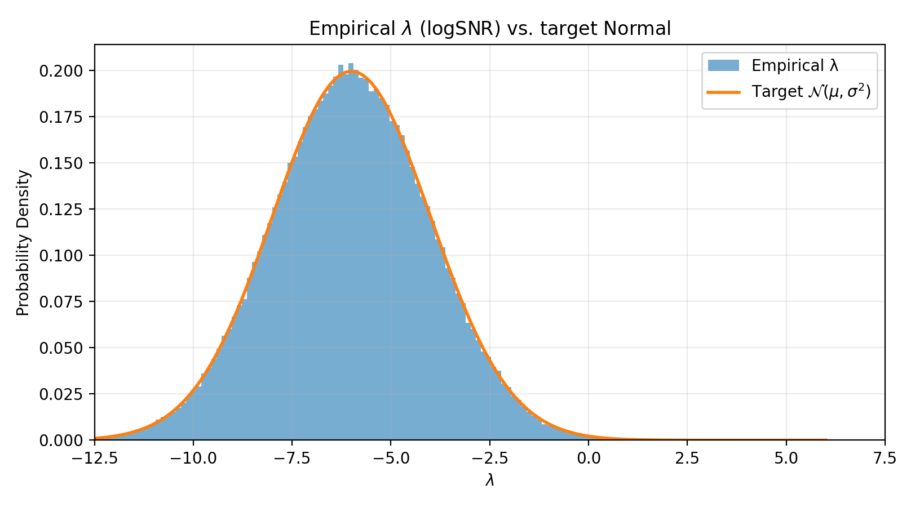
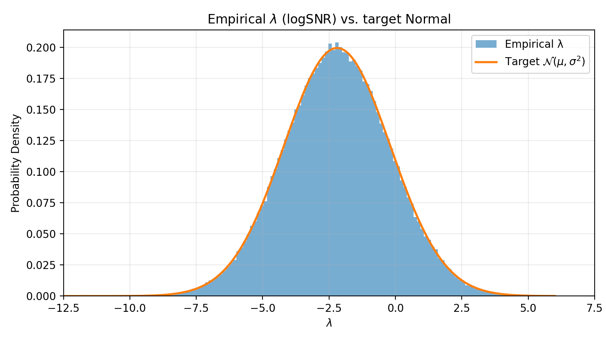
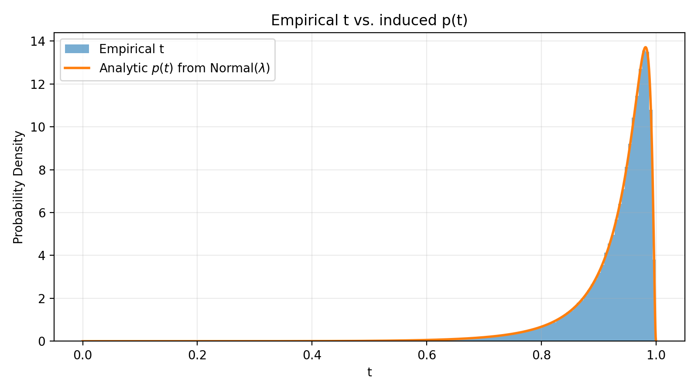
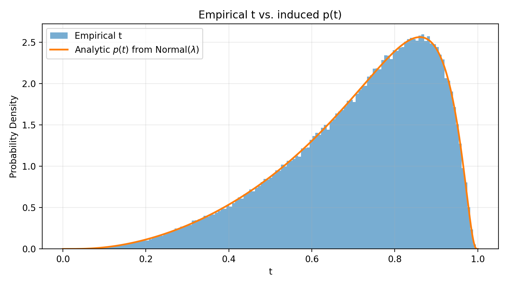
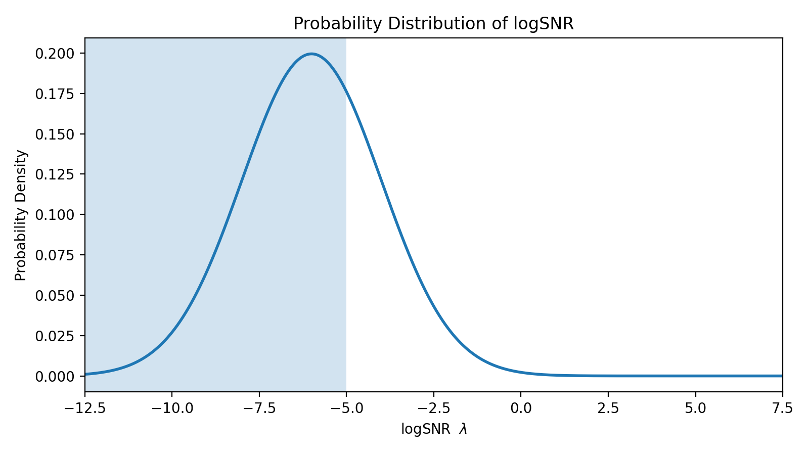
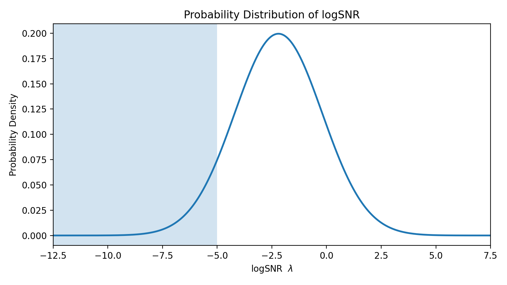

# Log-SNR Sampler Visualisation Utilities

[中文版 README](docs/README_zh.md)

This repository provides **stand-alone visualisation utilities for probability distributions in log-SNR (λ) space**, as used by recent diffusion models such as SD3 / FLUX and *Style-Friendly SNR Sampler for Style-Driven Generation* (arXiv:2411.14793).

**Note**: This repository is an **independent re-implementation** for educational and visualisation purposes only, and is **not** the official code release of the *Style-Friendly SNR Sampler for Style-Driven Generation* paper.

The code does **not** train or sample a diffusion model.  Instead, it supplies two light-weight Python scripts that help you

* verify the statistical properties of a Gaussian (Normal) sampler in log-SNR space; and
* reproduce Figure-style plots of the target log-SNR distributions that appear in the paper above.

---
## 1. Repository Structure

| File | Purpose |
|------|---------|
| `fake_loop_snr.py` | A *fake* training loop that draws λ values from a user-defined Normal distribution, converts them to the corresponding time steps $t = \sigma(-\lambda/2)$, and registers this custom grid with `diffusers.schedulers.FlowMatchEulerDiscreteScheduler`.  It accumulates thousands of samples and writes three diagnostic PNGs (histograms of λ and *t*, plus the target λ PDF) to disk. |
| `plot_style_friendly_logsnr.py` | A pure-plotting utility that produces publication-ready curves of several Normal PDFs in log-SNR space.  It reproduces the four curves from Fig. 2 of the *Style-Friendly* paper and allows fully custom sets via a JSON CLI argument. |

Both scripts are completely independent from any model checkpoints — they only depend on NumPy, Matplotlib, and (for `fake_loop_snr.py`) *diffusers* + *PyTorch* **≥ 1.13**.  Everything runs on CPU by default; GPU is optional.

---
## 2. Installation

1. **Clone** the repo (or simply copy the two scripts)

   ```bash
   git clone https://github.com/your-name/LogSNRVis.git
   cd LogSNRVis
   ```

2. **Create a Python environment** (optional but recommended)

   ```bash
   python -m venv .venv
   source .venv/bin/activate
   ```

3. **Install dependencies**

   ```bash
   pip install torch diffusers matplotlib numpy
   ```

   • *torch* ≥ 1.13 is required only for `fake_loop_snr.py`.<br/>
   • If you do **not** intend to run that script, you may skip *torch* and *diffusers*.

---
## 3. Usage

### 3.1 `fake_loop_snr.py`

This script is meant as a sanity check for a Gaussian log-SNR sampler.
It repeatedly

1. samples a batch of λ values from $\mathcal{N}(\mu,\sigma^2)$;
2. optionally applies a resolution shift (SD3 rule): $\lambda \leftarrow \lambda - 2\log\alpha$ where $\alpha=\sqrt{\tfrac{m}{n}}$;
3. maps each λ to a diffusion time step $t = \sigma(-\lambda/2)$;
4. registers the **sorted** list of *t* with `FlowMatchEulerDiscreteScheduler.set_timesteps()`;
5. accumulates the samples for plotting.

#### Default configuration

```python
SAVE_NAME    = "style_friendly_"   # prefix for output PNGs
MU_LAMBDA    = -6.0                # mean of Normal in λ
SIGMA_LAMBDA = 2.0                 # std-dev of Normal in λ
BATCH_SIZE   = 256                 # samples per iteration
NUM_ITERS    = 1000                # total iterations (≈ 7.7e4 samples)
ALPHA        = 1.0                 # resolution scale (α>1 → shift toward lower log-SNR)
DEVICE       = torch.device("cpu") # or "cuda"
```

Run the script:

```bash
python fake_loop_snr.py
```

Three PNG files will be created in the working directory:

* `<SAVE_NAME>lambda_hist_verify.png` – Histogram of λ overlaid with the target Normal PDF;
* `<SAVE_NAME>t_hist_verify.png`      – Histogram of *t* overlaid with the induced analytical density *p*(t);
* `<SAVE_NAME>logsnr_pdf.png`         – Stand-alone plot of the target λ PDF.

Use the global constants at the top of the file to change the distribution, batch size, resolution scale, number of iterations, or output prefix.

### 3.2 `plot_style_friendly_logsnr.py`

A quick CLI wrapper around Matplotlib for drawing Normal distributions in λ.
By default it reproduces the four curves from the paper:

1. SD3 / FLUX training: $\mathcal{N}(\mu = -2\log 3, \sigma = 2)$
2. Style-friendly: $\mathcal{N}(\mu = -6, \sigma = 1)$
3. Style-friendly: $\mathcal{N}(\mu = -6, \sigma = 2)$
4. Style-friendly: $\mathcal{N}(\mu = -6, \sigma = 3)$

Basic invocation:

```bash
python plot_style_friendly_logsnr.py --out style_friendly_curves.png
```

Customise the x-range, number of samples, shading, and **curves** via CLI flags:

```bash
python plot_style_friendly_logsnr.py \
  --xmin -12.5 --xmax 7.5 --shade -5 \
  --curves '[{"mu":-2*math.log(3),"sigma":2,"label":"SD3 and Flux"}, {"mu":-6,"sigma":1,"label":"μ=-6 σ=1"}]' \
  --out custom_curves.png
```

The `--curves` flag expects a JSON list where each entry contains

* `mu`    – mean of the Normal in λ (string; Python expressions allowed, e.g. `-2*math.log(3)`),
* `sigma` – standard deviation,
* `label` – (optional) legend label.

---
## 4. Notes on Resolution Shifting (SD3 Rule)

If you train at multiple resolutions, SD3 uses a deterministic shift in log-SNR:

\[ \Delta\lambda = -2\log\alpha, \qquad \alpha = \sqrt{m/n} \]

Setting `ALPHA>1` in `fake_loop_snr.py` demonstrates this effect and prints the expected constant shift.

---
## 5. Reference

> **Style-Friendly SNR Sampler for Style-Driven Generation**.<br/>
> Xi Chen, et al. 2024. arXiv:2411.14793

---
## 6. Sample Output Gallery

Below you can find **six PNGs** generated by the repository—three for the *Style-friendly* distribution and three for the *SD3 / Flux* distribution.  They serve as a concrete visual reference for the statistics produced by `fake_loop_snr.py`.

| File | What it shows | How to interpret |
|------|---------------|------------------|
| `style_friendly_lambda_hist_verify.png` | Histogram of empirical λ (blue bars) vs. the target Normal PDF (orange curve). | Bars should closely follow the analytic line, confirming that the sampler obeys $\mathcal{N}(\mu=-6,\sigma=2)$. |
| `style_friendly_t_hist_verify.png` | Histogram of time–step *t* induced by the same λ samples, compared to the analytical *p*(t) (orange). | Agreement validates the *change-of-variables* derivation $p(t)=\text{Normal}(\lambda(t))|\tfrac{d\lambda}{dt}|$. |
| `style_friendly_logsnr_pdf.png` | Stand-alone plot of the target Normal PDF in λ space with the high-noise region (λ ≤ −5) shaded. | Visually emphasises where style features are expected to emerge. |
| `sd3_flux_lambda_hist_verify.png` | Same as above but for SD3 / Flux distribution: $\mu=-2\log 3,\sigma=2$. | Confirms the SD3 training sampler shape. |
| `sd3_flux_t_hist_verify.png` | Same as above for *t* histogram. | Validates the corresponding *t* density for SD3. |
| `sd3_flux_logsnr_pdf.png` | Stand-alone λ PDF for SD3 / Flux with shaded high-noise area. | Highlights how SD3 places more probability mass at higher SNRs compared to the style-friendly sampler. |

Below are inline thumbnails (GitHub friendly):

<p align="center">
  
  
  <br/>
  
  
  <br/>
  
  
</p>

---
## 7. Authors

- **Tian YE** — PhD student, Hong Kong University of Science and Technology (Guangzhou)
- **ChatGPT O3** — Large-language-model co-author assisting with code and documentation

---
## 8. License

The code is released under the MIT license (see `LICENSE` file).
